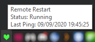

# 💚 Remote Restart
## Description

This is a C# / .NET Project that listens to a firebase database for changes that trigger the *shutdown /r* command in Windows.

## Usage
Install the *Setup.msi* file and the program should start running. It will also run at startup.

The client's Machine Name will be listed on the [dashboard](https://remote-restart.web.app) and can be restarted if the program is active.