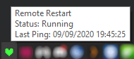
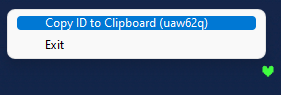
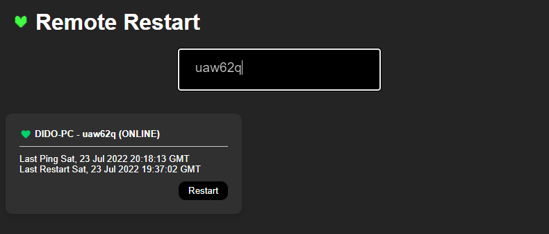

# 💚 Remote Restart
## Description

This is a C# / .NET Project that listens to a firebase database for changes that trigger the *shutdown /r* command in Windows.

## Usage
1. Install the *Setup.msi* from the latest release and the program should start running. It will also run at startup.
2. Right-click the tray icon, select Copy the ID to Clipboard.

3. Paste the generated code into the website https://remote-restart.web.app/ and press Enter.

The client's Machine Name will be listed on the [dashboard](https://remote-restart.web.app) and can be restarted if the program is active.

## Notes
- There will be a popup where you can cancel the restart if you clicked restart accidentally (for a few seconds).

- The IDs will be saved to local store on the device where it was added, so if you want to use another device as a trigger, you'll have to visit the website and insert the machine code again.

- Leaking your unique ID means someone else might be able to restart your PC, so avoid being pranked.
